# AI Files' Manager

This application uses the open-source OpenAI CLIP model to obtain embeddings from images that you store in an AWS S3 Bucket, then allowing to search those images using text prompts. The architecture of this AWS Application can be seen in the Figure below:

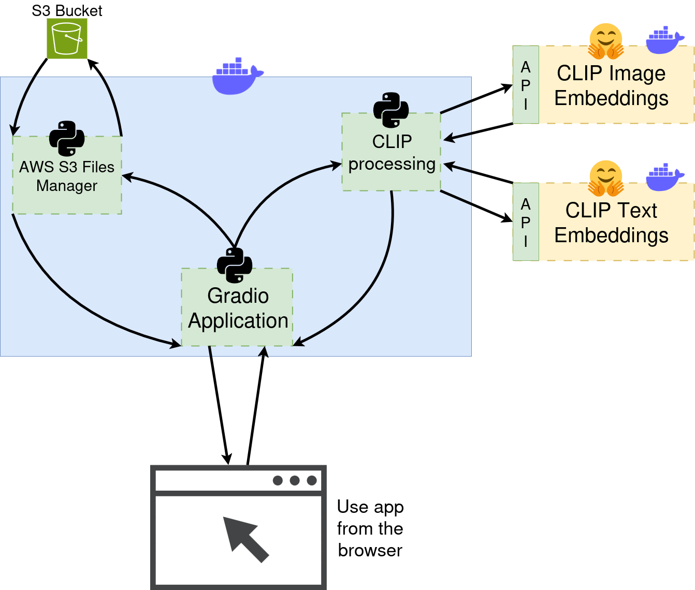

In particular, to avoid using paid virtual machine instances from AWS, we have decided to run the extraction of image embeddings, text embeddings and similarity computation in two different HuggingFace Spaces, which codes are running within a Docker container.

The implemented Gradio application has two use cases: <code>Upload Images</code> and <code>Search Images</code>. The used code is present in this repository, while the needed HuggingFace Spaces are <a href="https://huggingface.co/spaces/DanielIglesias97/CLIP_Images_Embeddings">this one</a> and <a href="https://huggingface.co/spaces/DanielIglesias97/CLIP_Text_Embeddings">this one</a>. Apart from the running space itself (that, if you want to use, make sure that is not sleeping), you can also check the code and clone its repository from the Files tab of each Space.

- **Upload Images:** With upload images, a set of files is uploaded to the S3 bucket. However, this is not an usual file upload, as the embeddings of the images are obtained and added to a so-called index file (a CSV file that can be managed as a pandas dataframe).

- **Search Images**: With this use case, the user prompts a text query, the application obtains the embeddings of that text, computes the similarity between that text and all the images within the index and then returns a list of files from the most similar to the least similar.

Given that this repo is not intended to explain how to set up and interact with a S3 Bucket, you can check how to do it in the various tutorials present on the Internet, as the process as fairly simple. Apart from that, the repo contains a <code>config.cfg</code> file where you need to setup the ID of the bucket to which you want to connect and the access keys (that have not been uploaded for obvious safety reasons and you need to change yourself to fit your situation).

## Upload Images

The steps followed to upload a set of images are described in the Figure below.

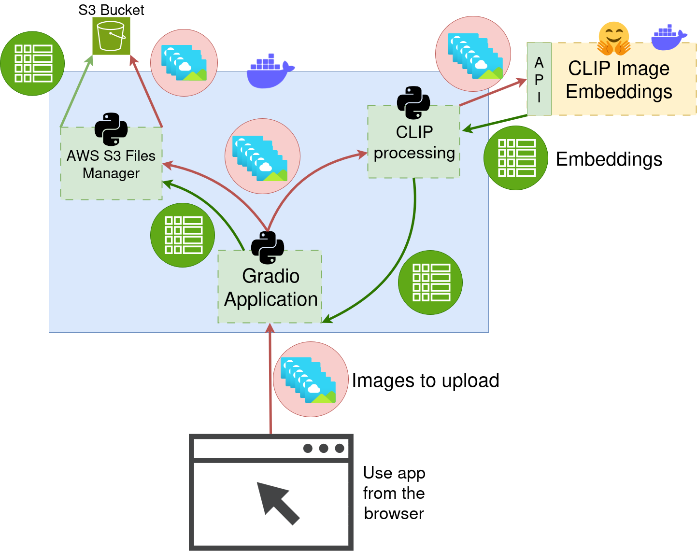

Firstly, the user will select the images that they want to upload and will click <code>Upload</code>. Internally, the Gradio Application will use the CLIP processing module to connect with the HuggingFace Space "CLIP Image Embeddings". The aim here is to extract the embeddings from the images and store or append them in an <code>index.csv</code>. During the final step of this use case, that consists on asking the AWS S3 Files Manager to upload the files, both the images and the new <code>index.csv</code> file are uploaded to the S3 Bucket.

**Use of the application:** Once we have the application running, the first that will be displayed is what can be seen in the Figure below:

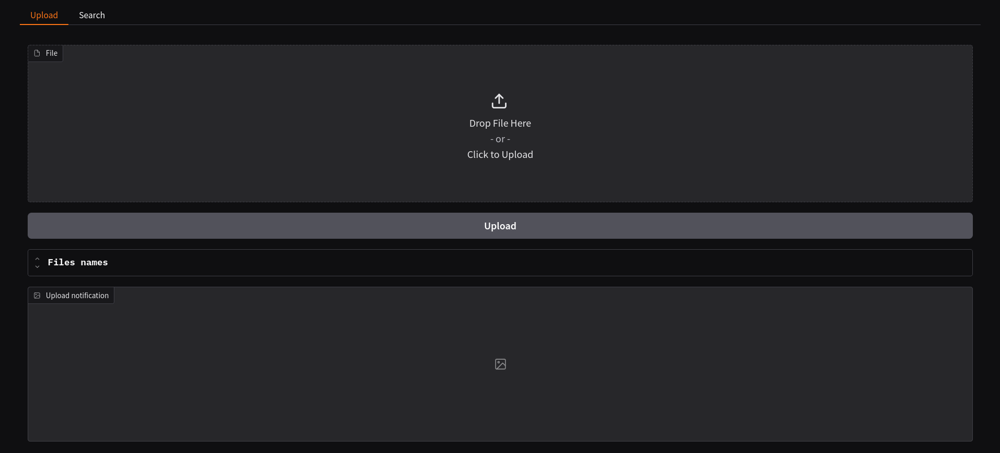</img>

Very intuitively, the files we want to upload are dropped in the corresponding area, leaving something like the following screen:

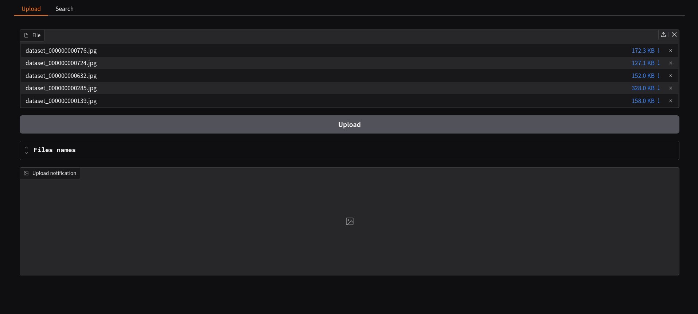</img>

The process might last more than 10 seconds for one image, as it is not only necessary to upload the files, but also to obtain the embeddings of the images. Of course, for a greater amount of files, the time spent in computation will be also higher.

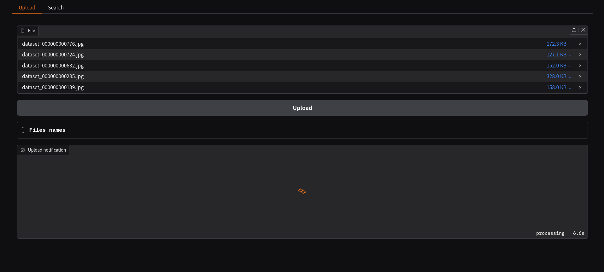</img>

After the files are uploaded, all the contents of the bucket will be listed in the way that can be seen in the Figure below.

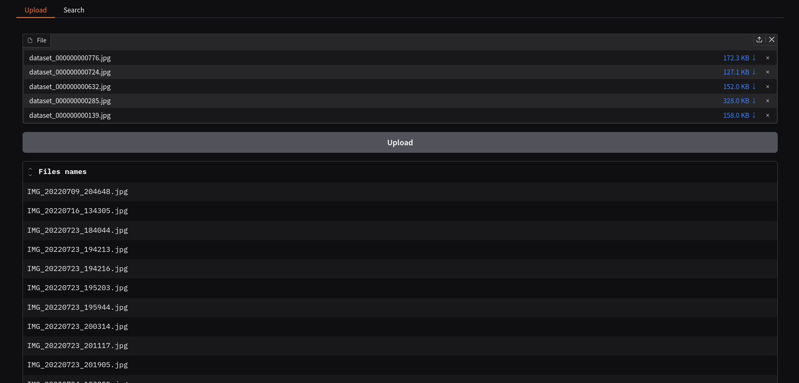</img>

## Search Images

Once the files are uploaded, we can proceed to make a search. Internally, the followed steps are depicted in the Figure below:

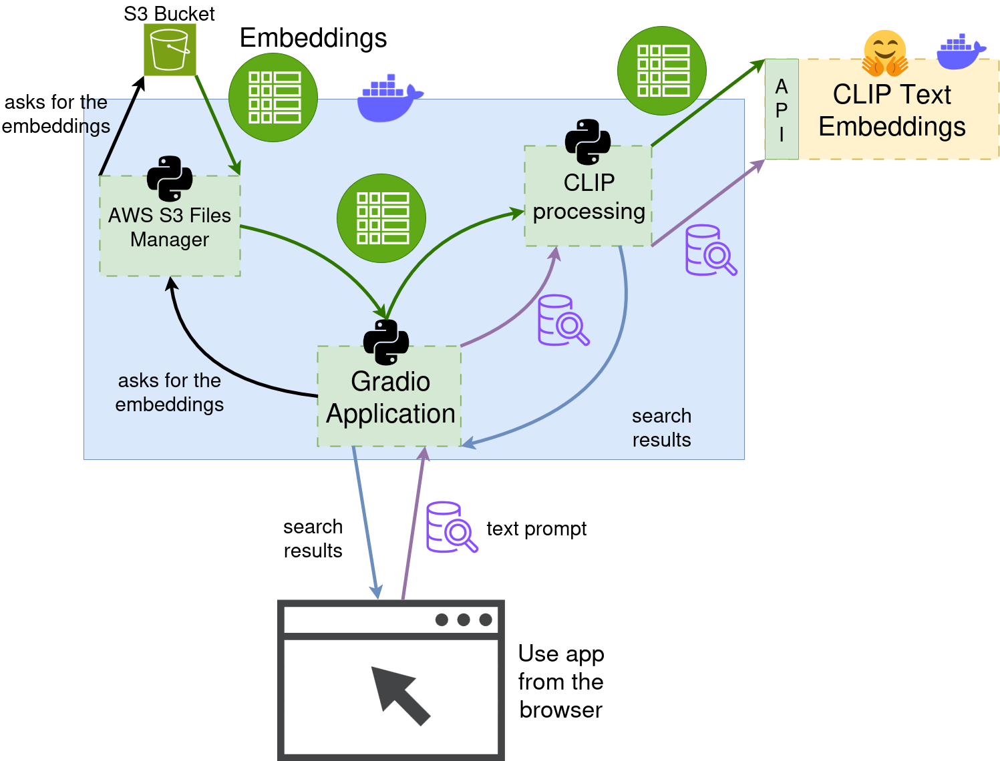

Particularly, the user will go to the browser, type the search in a text box and then click <code>Search</code>. This will send the text to the Gradio Application. After that, the application will ask for the stored embeddings that have been saved to the S3 Bucket.

Having the text prompt and the image embeddings, the Gradio Application will forward both things to CLIP processing module, to compute the similarity between that text prompt and the embeddings. That similarity is what we call "search results", and will be finally returned to the user. In the application, it will be seen as a list of files, placing the most similar ones at the top and the least similar ones at the bottom.

**Use of the application:** The use of the application regarding the search use case is also very intuitive. The initial screen you will see is like follows:

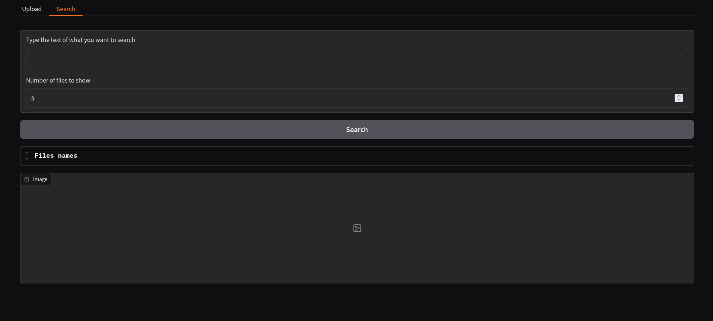</img>

There you can type the text prompt of the images that you want to search and select the number of files that you want the search to return (I have not done something like applying a threshold to the obtained similarities or something like that, so choose the number of files that you want to retrieve).

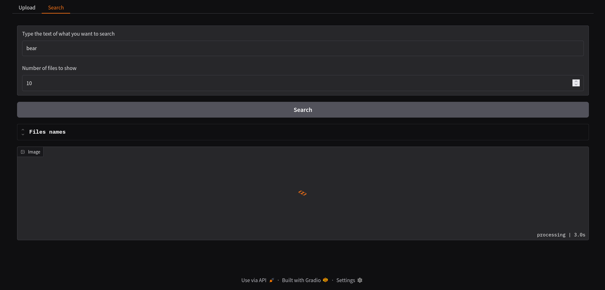</img>

After a few seconds of searching, the list you are going to obtain will be something like what you can see in the following picture:

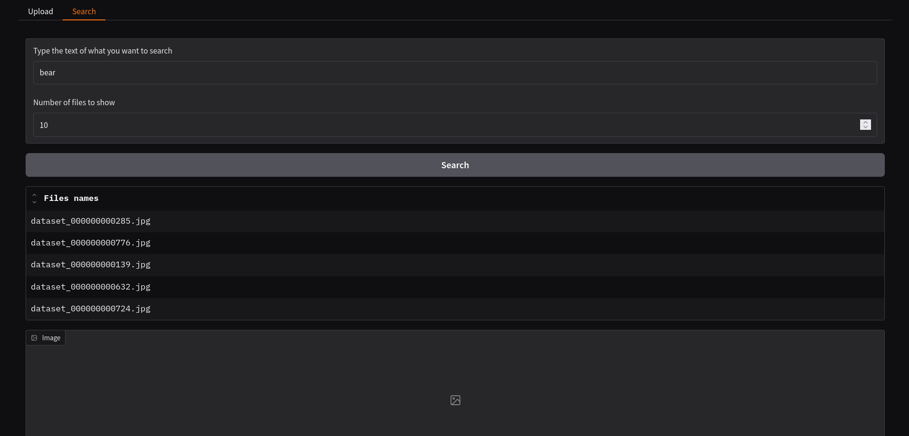</img>

After that, just click the names of the images to watch them in the display attached below.

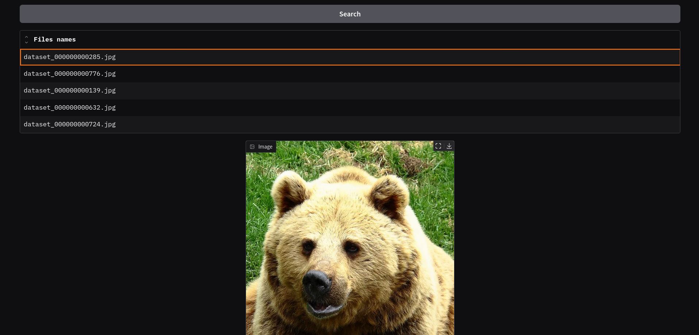</img>